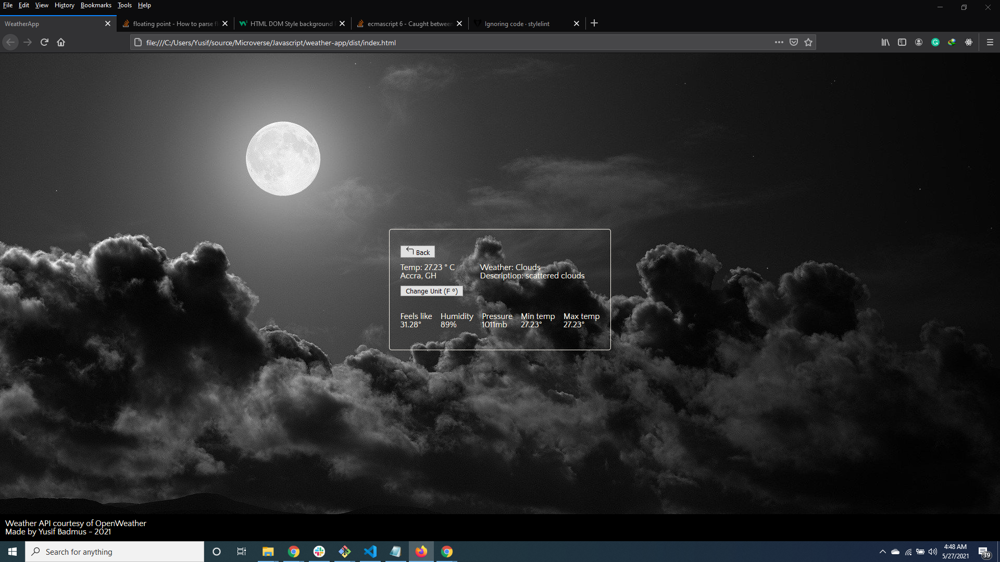

##  Weather App
The Weather App project comes at the end of the Asynchronous Javascript and APIs section of the Javascript course. It tests the knowledge of the student about asynchronous communication with promises or async/await and when to use them.

## Live Link
Visit the [Weather App](http://www.ybadmus.me/weather-app/) to get started

### Objectives:
- Functional programming
- Principles of Object-oriented design
- Code organization with ES6 modules in Javascript
- Using Webpack for compiling Javascript modules
- DOM manipulation
- ES6 Async and Await
- Sending and receiving API calls

## Prerequisites
- Internet Connection
- Git GUI
- An Integrated Development Environment
- Chrome and Firefox. Partial support is available on Safari. Internet Explorer is not supported.
- Node Package Manager [(NPM)](https://docs.npmjs.com/about-npm)

## Tools/Built With
- JavaScript ES6
- Webpack
- Bootstrap
- HTML5/CSS3
- NPM

## Getting Started
- To get started with the app, create an account on OpenWeather official website and obtain your API Key.
- Clone this project by running `git clone https://github.com/ybadmus/weather-app.git`.
- Run `npm install` to install the needed packages and dependencies.
- Open the directory in your preferred IDE to view source files.
- Add a new .env file to the root folder.
- Add `API_KEY='The key you got in step 1'` and `BASE_URL=https://api.openweathermap.org/data/2.5/weather` in the .env file.
- Run `npm run watch` and fire up a local server to view any dev changes.
- Open the index.html file in the `./dist` folder or visit `http://localhost:8080/` to launch the application in the browser.
- To terminate the server, enter `Ctrl + C` in your terminal.

## Authors

👤 Yusif Badmus

- GitHub: [@ybadmus](https://github.com/ybadmus) 
- LinkedIn: [LinkedIn](https://www.linkedin.com/in/ybadmus/)
- Twitter: [@yusif_badmus](https://twitter.com/yusif_badmus)

## Acknowledgments

- [Microverse](https://www.microverse.org)
- [Odin Project](https://www.theodinproject.com/paths/full-stack-javascript/courses/javascript/lessons/weather-app)
- [Open Weather](https://openweathermap.org/)

## Show your support

Leave a :star:️ &nbsp; if you like this project!

## License

Available as open source under the terms of the [MIT License](https://opensource.org/licenses/MIT).
